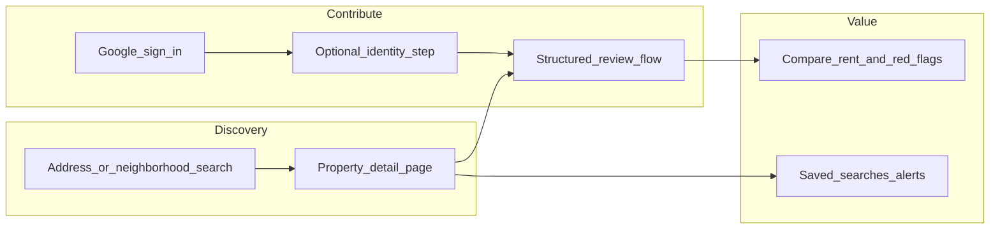

# Boston rental reviews: product and platform scope

## Problem and positioning

**Promise:** Help Boston renters avoid bad situations and price blind spots by combining **property-level experiences**, **historical rent signals**, and **optional utility/context**—with enough **trust and anti-spam** that the signal stays credible.

**Differentiation vs generic review sites:** Hyper-local (Boston metro), **address-level** truth (not just "neighborhood vibes"), **structured data** (rent, dates, unit type), and **renter-first** norms (not landlord marketing).

**Competitive reality:** Similar concepts exist in fragments (Facebook groups, Reddit, StreetEasy comments). Winning means **searchable addresses**, **consistent schema**, **moderation**, and **habitual use** (e.g. before every tour).

### Product principles: simple, mobile-first, incentive-aligned

- **Primary audience:** Renters roughly **21–40** who move on phones, have low patience for long forms, and respond to **fast** "sign in with Google → done" flows.
- **Streamline ruthlessly:** Short structured fields first (rent, dates, unit type, tags), narrative optional or one tap; **progress saved** if they bounce.
- **Do not optimize for every edge case in v1:** One clear happy path beats ten optional modules on the home screen.

### Gated content (members-only results)

**Intent:** Hide **substantive** reviews and rent aggregates from logged-out users so creating an account feels necessary.

**Recommended pattern:**

- **Public/teaser layer:** Address exists, **aggregate teaser only** (e.g. "Several reviews · rent reports available" or star band without text), or **first sentence blur**—enough to prove the site has data, not enough to replace signup.
- **Authenticated layer:** Full reviews, rent charts, filters, saved addresses.

**Caveat — SEO and growth:** If *everything* valuable is behind login, **organic search** may underperform. Mitigate with **indexable** marketing pages (how it works, Boston rental guides, neighborhood list pages with **non-sensitive** stats or editorial content) and/or limited public snippets. Decide explicitly: **growth via SEO** vs **growth via referrals/social** (gated works better for the latter).

---

## Core user journeys

1. **Research (signed in):** Land on property or area → full aggregates, recent reviews, rent distribution.
2. **Research (signed out):** Teaser only → **sign in with Google** to unlock (keep friction minimal).
3. **Contribute:** Sign in with Google → optional "verified renter" doc upload → submit one **short** structured review.
4. **Return:** Alerts for new reviews on saved addresses; "similar buildings" suggestions.

---

## Trust, identity, and "real people"

### Recommendation: do **not** require lease or utility bill for baseline reviews

For a **simple, high-conversion** product aimed at **21–40 renters**, **mandatory** lease/utility proof is usually the wrong default:

- **Friction:** Finding a PDF, redacting, uploading on mobile **kills completion rates**; many people do not have a lease handy after move-out.
- **Equity:** Subletters, informal arrangements, or utilities in a roommate's name are **legitimate** but fail a rigid doc rule.
- **What it actually solves:** Doc proof helps **"lived at this address"**; it does less for **landlord retaliation campaigns** (bad actors can still upload once). You still need **rate limits, reports, and moderation**.

**Better default for v1:**

1. **Baseline review:** **Google OAuth** + clear **attestation** ("I confirm I lived at this address during the dates below") + **anti-spam rules** (one review per user per property per year, new-account limits) + **reporting**.
2. **Optional upgrade:** **"Verified renter"** badge if the user **chooses** to upload a **redacted** lease snippet or utility bill (manual or sampled review). Use this for **sorting weight** or a visible badge, not as a hard gate.
3. **Revisit mandatory docs** only if data quality or abuse metrics justify it after you have real usage.

**Government ID** (separate from lease/utility) can sit in the same **optional** "verified" tier: powerful for trust, but **heavy** on cost, privacy, and support—reasonable as an **upgrade**, not a default for 21–40 renters signing up in two taps.

**If you use ID verification at all**, treat it like lease/utility: **optional badge**, vendor-handled where possible, minimal retention. It is powerful but heavy:

- **Vendor path:** Use a specialized provider (e.g. persona/verification APIs) that handles KYC-style checks, not storing raw ID long-term unless you have a clear legal basis.
- **Costs:** Per-verification fees; support burden for failed scans.
- **Privacy expectations:** Users will ask what you store; regulators care about **data minimization** (see legal section).
- **Equity:** Not everyone has a current license; alternatives improve inclusion.

**Practical tiered model (recommended conceptually):**

| Tier                                | What it proves           | Good for                                        |
| ----------------------------------- | ------------------------ | ----------------------------------------------- |
| Google account                      | Low-friction signup      | Baseline                                        |
| Phone + SMS                         | Slightly higher friction | Sybil resistance                                |
| "Verified renter" (ID or doc-based) | Higher trust             | Featured weighting, not a gate for every review |

**Alternatives to full ID for "lived here" proof (often combined):**

- **Lease or utility bill upload** with automated redaction guidance (user blurs name/amounts); manual or sampled review.
- **Corroboration:** Multiple independent reviews over time; pattern detection.
- **Time-delayed privileges:** Full visibility or posting limits until account ages or completes steps.

**Important:** Tie verification goals to **what abuse you're stopping**: fake reviews vs. privacy vs. landlord retaliation. ID verification mainly helps **one-person-many-accounts** and **impersonation**, not "never lived there" unless paired with address proof.

---

## Anti-spam and the "one review per year" rule

Your intent: limit **review bombing** and **sock puppets**.

**Clarify the rule in product terms (decision needed later):**

- **Per user, per normalized address, per rolling 12 months:** One published review (edits may or may not reset clock). This is easy to explain and enforce.
- **"Years lived in Boston" as a cap:** Risky as the *only* limiter—new residents have zero years; long-timers could spam many addresses. Better as a **profile trust signal** ("claimed 4 years in Boston") than as the sole throttle.

**Additional abuse controls that work well in practice:**

- **Rate limits:** New accounts stricter (e.g. 1 review in first 30 days unless verified).
- **Duplicate detection:** Same IP/device/cluster, similar text, same landlord campaign.
- **Report + human moderation** for defamation and harassment.
- **Landlord reply (optional, moderated):** Reduces "one-sided slam" dynamics if done carefully.

---

## Data model (conceptual)

- **Normalized address** (Boston-specific geocoder + unit optional): dedupe "123 Main St #2" vs "123 Main Street 2".
- **Review:** dates of tenancy, rent, bedrooms, utilities ballpark, tags (mold, heat, noise, deposit), free text, photos (optional).
- **User:** OAuth id, verification tier, optional Boston tenure (self-reported or verified lightly).
- **Aggregates:** Median/mode rent by unit type and time window; complaint frequency tags.

---

## Legal, safety, and reputation (non-optional for launch quality)

- **Defamation / truth:** Clear **content policy**, **reporting**, **takedown process**, and jurisdiction-aware legal review before scale.
- **Fair housing:** Avoid features that **steer** by protected class; be careful with **neighbor/area** commentary; train moderation on fair housing basics.
- **SLAPP / retaliation:** Document retention and user safety (optional pseudonymity for display name with verified backend identity).
- **Terms of service:** Prohibited content, DMCA if you allow images, arbitration clause only if counsel agrees.

This is a **consult-a-lawyer** area for Massachusetts-specific nuance—not something to improvise from a template alone at scale.

---

## Features that make people *want* to use it

**Must-have (MVP credibility):**

- Address search with **autocomplete** and **clear property pages**; **gated** full content behind **Google sign-in** with a **clean teaser** for logged-out users.
- **Structured review form** kept **short** (rent, lease type, dates, tags; narrative optional).
- **Google sign-in** as the primary auth path.
- **Spam controls** (rate limits + one review per address per user per year).
- **Report review** + basic moderation queue.

**High-impact "delight":**

- **Rent history chart** by bedroom count (with "n = …" and date range).
- **Utility bands** (electric gas water) as optional structured fields.
- **Tour checklist** PDF or shareable link from a property page ("questions to ask").
- **Email alert** when a saved address gets a new review.
- **Neighborhood landing pages** (SEO + browsing): median rent, top issue tags—not demographic steering.

**Trust and depth:**

- **Verification tiers** with transparent badges.
- **Photo uploads** with EXIF stripping and moderation.
- **"Was this helpful?"** on reviews to surface quality (not just recency).

**Community / growth (later):**

- Partner with **tenant unions / legal aid** for resources (credibility, backlinks).
- **Anonymous** display with verified account (reduces fear of landlord retaliation).

**Things to be careful with:**

- **Naming individuals** (superintendent, neighbors): higher legal and harassment risk; consider discouraging or strict moderation.
- **Exact unit numbers** in small buildings: balance transparency with **stalking/safety**; sometimes "building-level only" is safer.

---

## Technical stack (directional, not prescriptive)

- **Web app:** React/Next.js or similar; **PostGIS** or equivalent for address normalization and geo queries.
- **Auth:** Google OAuth via **Auth provider** (Clerk, Auth0, Firebase Auth, or NextAuth) to move fast and securely.
- **ID verification:** Third-party API if you commit to that tier.
- **Infra:** Managed DB, object storage for optional documents/images, queue for moderation jobs.

---

## Phased roadmap (suggested)

1. **Discovery slice:** Property pages + search + read-only seeded or imported public data if any (careful with licensing).
2. **Contributions slice:** Google auth + review submit + anti-spam rules + reports.
3. **Trust slice:** Verification tier + document upload path + moderation tooling.
4. **Retention slice:** Alerts, saved searches, rent charts refinement.

---

## Open decisions to resolve before build

1. **Review rule:** Rolling 12 months per user per normalized address vs calendar year; whether **edits** count as new reviews.
2. **Verification:** Plan assumes **no mandatory** lease/utility for baseline; confirm **optional verified badge** rules and whether **phone SMS** is worth adding for Sybil resistance.
3. **Gated content + SEO:** How much is public (teasers only vs indexed guides) so **referral/social-first** growth does not starve if Google sends little traffic to thin pages.
4. **Geography:** City of Boston only vs **Greater Boston** (affects SEO and moderation scope).
5. **Landlord entities:** Allow naming management companies vs discourage individual names.

These choices materially affect **legal review**, **DB design**, and **UX**.

---

## Summary

The idea is **strong** if you pair **structured, address-level data** with **clear anti-spam rules**, **moderation**, and **legal groundwork**. For **21–40 renters**, optimize a **simple mobile path**: **Google OAuth**, **short forms**, and **gated** full results to drive signups—while planning **public marketing/SEO** so discovery does not die behind the wall. **Do not require** lease or utility bills for baseline reviews; offer **optional "verified renter"** (redacted docs) for credibility and sorting. Lead with **rate limits and reporting**; add **stronger verification** only as a **badge**, not a gate. Refine the "one review per year" rule to **per user per property** and use **years in Boston** as a **signal**, not the only throttle. Layer **rent/utilities aggregates**, **alerts**, and **neighborhood** content to drive repeat use beyond a single search.
